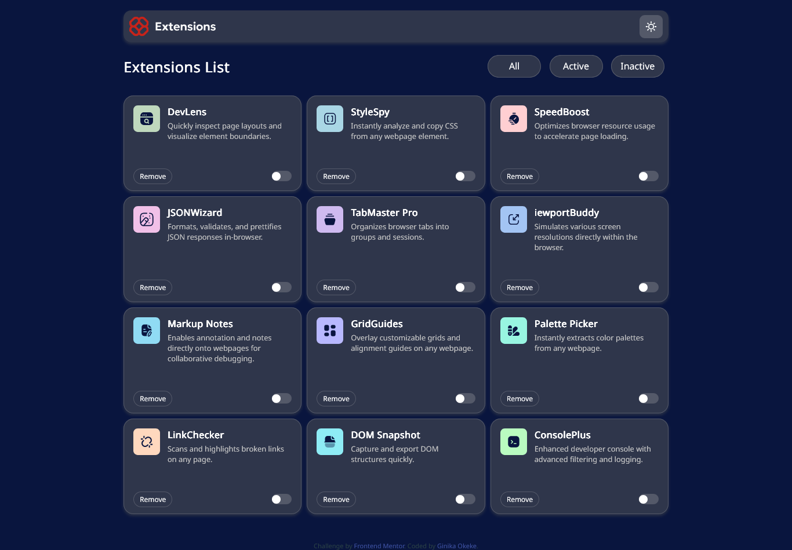

# Frontend Mentor - Browser extensions manager UI solution

This is a solution to the [Browser extensions manager UI challenge on Frontend Mentor](https://www.frontendmentor.io/challenges/browser-extension-manager-ui-yNZnOfsMAp). Frontend Mentor challenges help you improve your coding skills by building realistic projects. 

## Table of contents

- [Overview](#overview)
  - [The challenge](#the-challenge)
  - [Screenshot](#screenshot)
  - [Links](#links)
- [My process](#my-process)
  - [Built with](#built-with)
  - [What I learned](#what-i-learned)
  - [Continued development](#continued-development)
  - [Useful resources](#useful-resources)
  - [AI Collaboration](#ai-collaboration)
- [Author](#author)
- [Acknowledgments](#acknowledgments)

## Overview

### The challenge

Users should be able to:

- Toggle extensions between active and inactive states
- Filter active and inactive extensions
- Remove extensions from the list
- Select their color theme
- View the optimal layout for the interface depending on their device's screen size
- See hover and focus states for all interactive elements on the page

### Screenshot



### Links

- Live Site URL: [Add live site URL here](https://browser-extensions-manager-ui-main-theta.vercel.app/)

## My process

### Built with

- Semantic HTML5 markup
- CSS custom properties
- Flexbox
- CSS Grid
- Mobile-first workflow

  
### What I learned

This was a challenge, probably the most demanding project so far. Doing this taught me a LOT about JavaScript. I feel more comfortable chaining functions together to add interactivity to websites now. Took a bit out of mee but I am determined to keep improving my skills.

This little function below is where it all clicked together for me. It's all about problem solving! I was able to change the state of each extension to "active" or "inactive" by updating their class attributes using the toggle in each of them. 
```js
toggleInputs.forEach(toggleInput => {
    toggleInput.addEventListener("change", ()=>{
      let toggleID = toggleInput.getAttribute("id").split("-checkbox");
            let extensionID = toggleID[0];
        if (toggleInput.checked) {
            extensionClass = document.getElementById(extensionID).getAttribute("class");
      
                extensionClassInner = document.getElementById(extensionID).getAttribute("class");
                extensionClassInner = "extensions active";
                document.getElementById(extensionID).setAttribute("class", extensionClassInner);
        } else  {
            extensionClassInner = document.getElementById(extensionID).getAttribute("class");
            extensionClassInner -= "active";
                extensionClassInner = "extensions inactive";
                document.getElementById(extensionID).setAttribute("class", extensionClassInner);
        }
    });
});
```

### Continued development

There are some obvious issues. For one when removing each extension, there are inconsistencies in what message is displayed on the page depending on the button you click (if a message at all). I also want to add a prompt message that asks the user "if they wish to remove this extension" and if they click "yes", the extension is removed and a toast message is displayed. Hopefully I am able to make these fixes and updates in the coming days.

### Useful resources

- [Example resource 1](https://www.example.com) - This helped me for XYZ reason. I really liked this pattern and will use it going forward.
- [Example resource 2](https://www.example.com) - This is an amazing article which helped me finally understand XYZ. I'd recommend it to anyone still learning this concept.

**Note: Delete this note and replace the list above with resources that helped you during the challenge. These could come in handy for anyone viewing your solution or for yourself when you look back on this project in the future.**

### AI Collaboration

Describe how you used AI tools (if any) during this project. This helps demonstrate your ability to work effectively with AI assistants.

- What tools did you use (e.g., ChatGPT, Claude, GitHub Copilot)?
- How did you use them (e.g., debugging, generating boilerplate, brainstorming solutions)?
- What worked well? What didn't?

**Note: Delete this note and the content above if you didn't use AI, or replace with your own experience.**

## Author

- Website - [Add your name here](https://www.your-site.com)
- Frontend Mentor - [@yourusername](https://www.frontendmentor.io/profile/yourusername)
- Twitter - [@yourusername](https://www.twitter.com/yourusername)

**Note: Delete this note and add/remove/edit lines above based on what links you'd like to share.**

## Acknowledgments

This is where you can give a hat tip to anyone who helped you out on this project. Perhaps you worked in a team or got some inspiration from someone else's solution. This is the perfect place to give them some credit.

**Note: Delete this note and edit this section's content as necessary. If you completed this challenge by yourself, feel free to delete this section entirely.**
